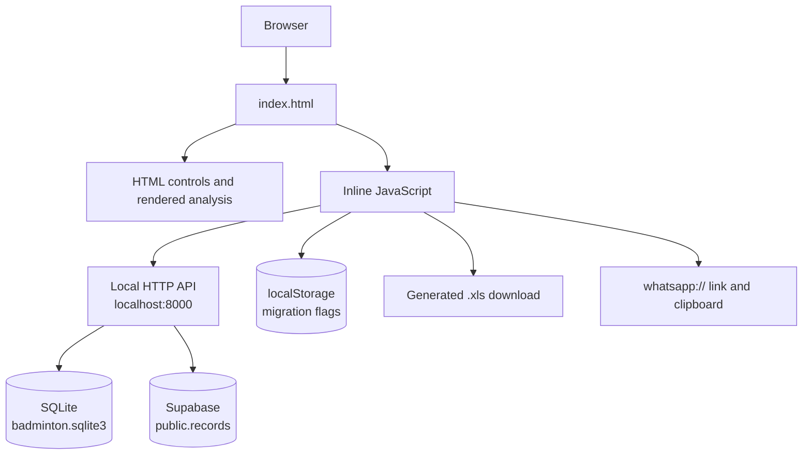

# Badminton Attendance: High-Level Design

## 1. Purpose

Badminton Attendance is a browser-based attendance and cost-sharing tool for a fixed group of badminton participants. It records daily participation, court expenses, shuttle purchases, sponsors, monthly summaries, settlement amounts, and a participation heatmap.

The application uses a local HTTP API. It can use either the local SQLite database or a Supabase project as the storage backend. SQLite is useful for local-only use; Supabase is the target backend for sharing data across the web tool and a mobile app.

## 2. Runtime Architecture



### Components

- **Presentation:** HTML and CSS in `index.html`.
- **Application logic:** Inline JavaScript in `index.html`.
- **Primary persistence:** SQLite file `badminton.sqlite3` by default, or Supabase table `public.records` when `SUPABASE_URL` and a Supabase key are set.
- **Legacy migration:** Existing browser IndexedDB records can be transferred once into SQLite.
- **Migration state:** Browser `localStorage` keys used to prevent one-time imports and corrections from running repeatedly.
- **Exports:** An HTML table is packaged as an `.xls` download in the browser.
- **Messaging:** A participation message is copied to the clipboard and a WhatsApp URL is requested.

## 3. Data Model

The `marks` object store uses `id` as its key path and has a non-unique `date` index.

### Participation record

```js
{
  id: "2026-09-19:GANESH",
  date: "2026-09-19",
  name: "GANESH",
  recordType: "participation",
  value: 1 // optional; values above 1 are shown as partial/highlighted
}
```

Participation IDs follow `${date}:${name}`. A checkbox change writes or deletes the corresponding record.

### Court expense record

```js
{
  id: "expense:2026-09-19:MURALI", // or expense:${date} for an unallocated/legacy record
  date: "2026-09-19",
  amount: 340,
  sponsor: "MURALI", // optional
  recordType: "expense"
}
```

### Shuttle purchase record

```js
{
  id: "shuttle:2026-09-01:GANESH", // or shuttle:${date} for a legacy record
  date: "2026-09-01",
  amount: 5750,
  sponsor: "GANESH", // optional
  recordType: "shuttle"
}
```

## 4. Startup and Migration Flow

On page load:

1. Check the local SQLite API and import existing browser records once when the shared database is empty.
2. Import the embedded September participation data once.
3. Seed missing September court expense records with `340` only when the record does not already exist.
4. Seed the September 1 shuttle record once.
5. Add the historical court sponsor correction where applicable.
6. Restore the known September 20 participant records once.
7. Normalize legacy shuttle sponsor labels without changing stored amounts.
8. Render the selected date and monthly analysis.

Migration version flags are stored in localStorage. The database write logic also protects existing values, so clearing migration flags or rebuilding the link does not replace saved expense or shuttle amounts.

## 5. Main User Workflows

### Record participation

1. Select a date.
2. Check or uncheck participant names.
3. Each change is immediately written to the shared SQLite database through the local API.
4. The selected-day summary, metrics, table, and chart are re-rendered.
5. The participant list can also be explicitly saved as a batch.

### Record a cost

1. Select a date.
2. Select an optional sponsor.
3. Enter a court expense or shuttle purchase amount.
4. Save the record.
5. The relevant analysis and settlement calculations are refreshed.

### Review analysis

The analysis is recalculated from all records and includes:

- Session count
- Total participation
- Average participation per session
- Court expense total and unallocated amount
- Shuttle expense total
- Sponsor summaries
- Per-player participation and amount owed
- Priority settlement allocation
- Daily participation chart

### Export a month

The selected month is transformed into an HTML table and downloaded with an `.xls` extension. The export includes daily participation, participant counts, expenses, expense shares, shuttle purchases, sponsors, and an overall settlement table.

### Prepare WhatsApp message

The selected date's participants are formatted into a text message, copied to the clipboard when permitted, and passed to a `whatsapp://send` URL. The page cannot verify external delivery.

## 6. Calculation Rules

- Court expenses are divided among participants recorded on the same date unless the expense is unallocated.
- Shuttle totals are summed for the selected month.
- Players with more than five participation records in the selected month share the monthly shuttle total equally.
- Settlement allocations prioritize sponsors by recorded sponsored amount and assign each player's owed amount until it is settled.
- Participation values greater than `1` are displayed with the partial/value-above-1 chart state.

## 7. Persistence and Deployment

Start the shared application from the workspace folder with:

```powershell
py server.py
```

Then open:

`http://localhost:8000/`

The source file is located at:

`C:\Personnel\Coding\Badminton\index.html`

The shared database is stored at:

`C:\Personnel\Coding\Badminton\badminton.sqlite3`

To run against Supabase:

1. Run `supabase_schema.sql` in the Supabase SQL editor.
2. Set `SUPABASE_URL` and `SUPABASE_SERVICE_ROLE_KEY` locally.
3. Run `py migrate_sqlite_to_supabase.py` once.
4. Start the web tool with `start-server-supabase.bat`.

Because persistence is provided by the local server:

- Chrome and the VS Code browser use the same database when both open `http://localhost:8000/` on this computer.
- A mobile app can use the same Supabase `records` table directly with the Supabase client library.
- The old `file:///` link bypasses the shared API and should not be used for data entry.
- The server must be running for the app to load or save data.
- Opening the link on another device requires hosting the server on a reachable network address.
- Back up `badminton.sqlite3` to preserve the shared records.

## 8. Security and Reliability Considerations

- Data is local to the computer and is sent only to the local SQLite API.
- User-entered values should be validated before being used in calculations or generated export content.
- The exported document is generated locally and should be treated as a report, not as a synchronized source of truth.
- Migration functions must remain idempotent and must never overwrite an existing user record with a default value.

## 9. Future Evolution

Potential next steps, in increasing scope:

1. Add an explicit backup/import feature using JSON.
2. Add validation and user-facing save/error states.
3. Move application logic into separate JavaScript and CSS modules.
4. Add automated tests for migrations and calculation rules.
5. Add a backend API with authentication and shared storage for multi-device access.
6. Replace generated HTML-as-XLS export with a standards-based spreadsheet library if richer Excel compatibility is required.
